Detection
===
- [ ] 

|       | SSD | RFB | FSSD | YOLOV1 | YOLOV2 | YOLOV3 | YOLOV4 | YOLOV5 |
| ----- | --- | --- | ---- | ------ | ------ | ------ | ------ | ------ |
| train | - [x] | - []  |  [x] |   [x]  |   [x]  |   [x]  |   [x]  |   [x]  |

# 1.SSD
$300 \times 300$
|            |  vgg16  |  resnet50  |  resnet152  |  darknet19  |  mobilenetv1  |
| ---------- | :-----: | :--------: | :---------: | :---------: | :-----------: |
|   VOC-mAP  |  76.5%  |    79.2%   |    73.3%    |    74.4%    |     72.9%     |
|  VOC-Image | 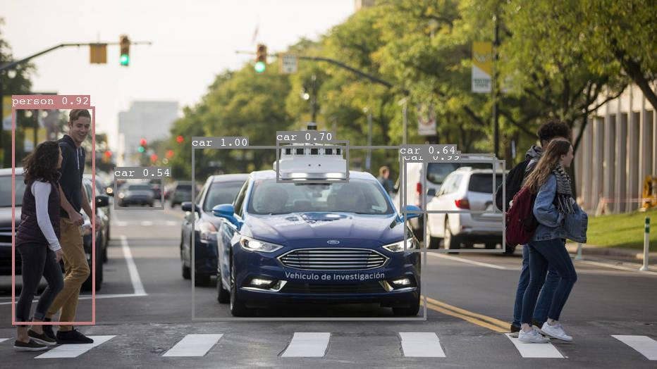 |  | 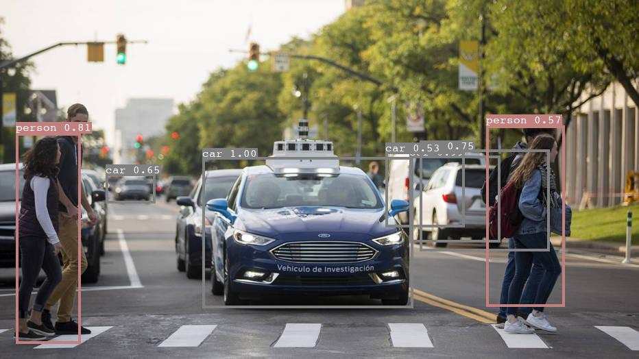 | 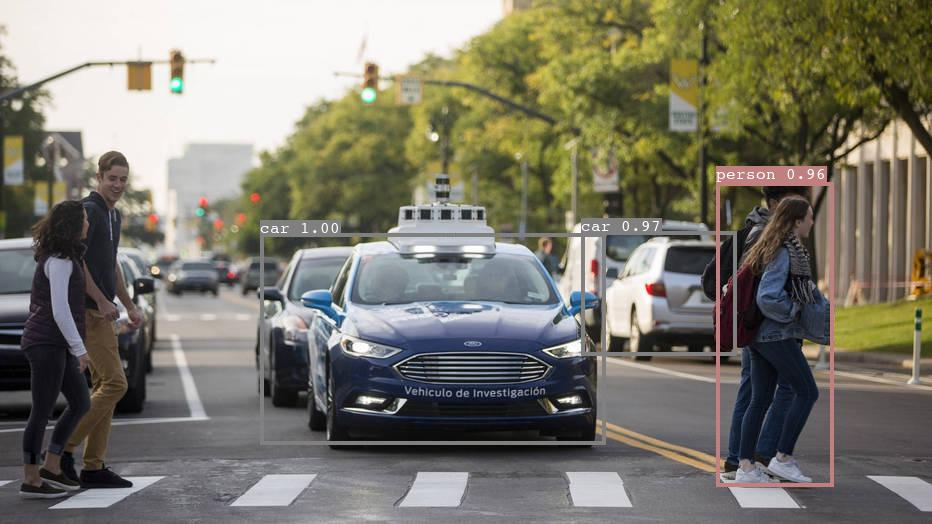 | 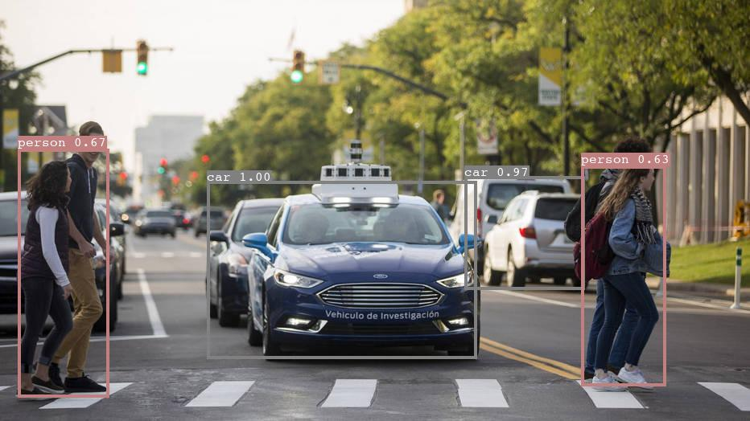 |
|  COCO-mAP  |  -----  |   25.0%    |             |    20.7%    |     18.8%     |
| COCO-Image |         | 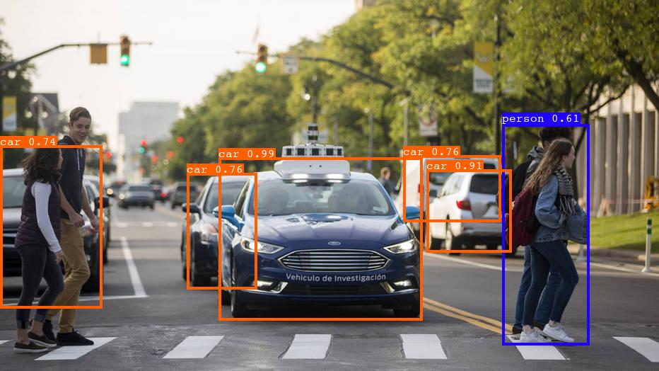 | |  |  |

# 2.RFB
$300 \times 300$
|            |  vgg16  |  resnet50  |  resnet152  |  darknet19  |  mobilenetv1  |
| ---------- | :-----: | :--------: | :---------: | :---------: | :-----------: |
|   VOC-mAP  |  79.0%  |            |             |    76.2%    |     73.8%     |
|  VOC-Image | 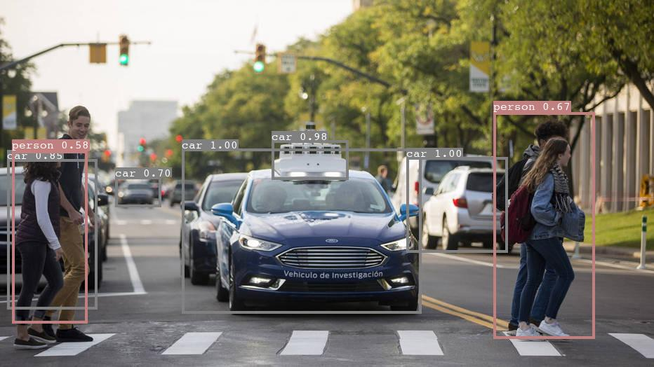 | | |  | 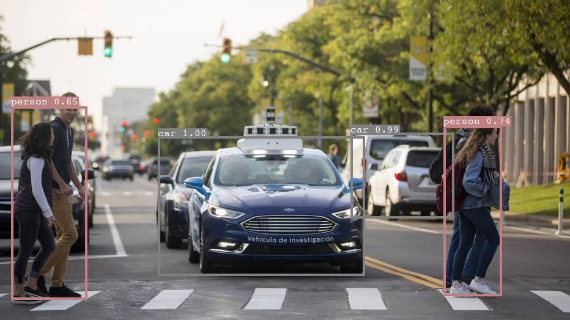 |
|  COCO-mAP  |         |            |             |    22.4%    |     19.0%     |
| COCO-Image |         | | | 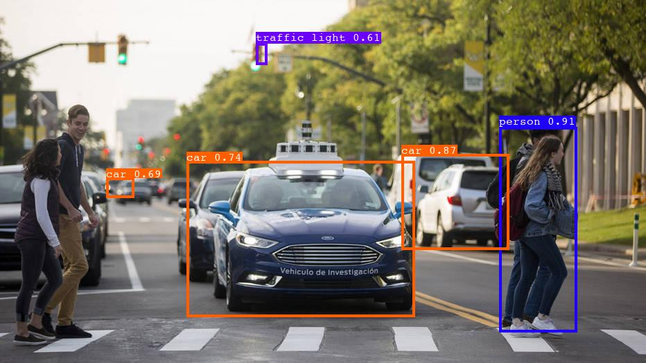 | 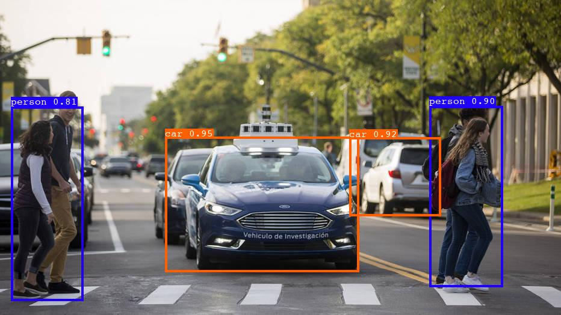 |

# 3.FSSD
$300 \times 300$
|            |  vgg16  |  resnet50  |  resnet152  |  darknet19  |  mobilenetv1  |
| ---------- | :-----: | :--------: | :---------: | :---------: | :-----------: |
|   VOC-mAP  |  77.9%  |    74.0%   |    74.1%    |    78.2%    |     73.5%     |
|  VOC-Image | 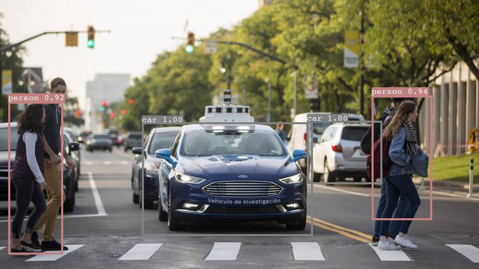 | 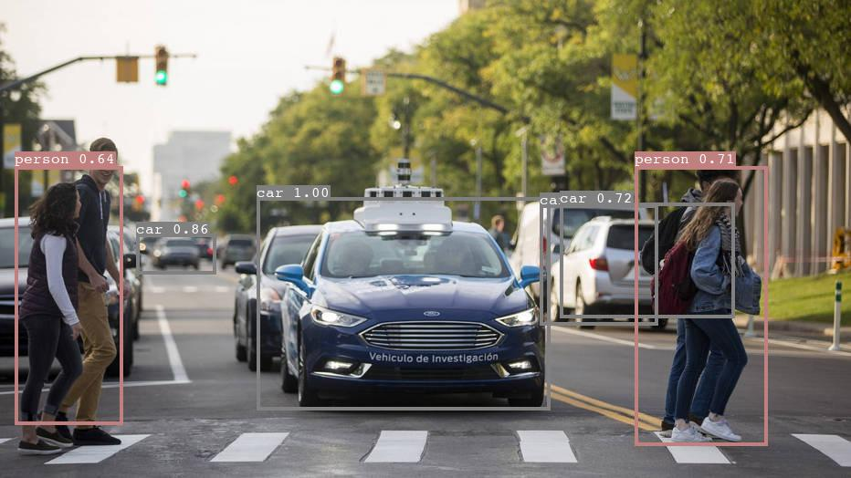 | 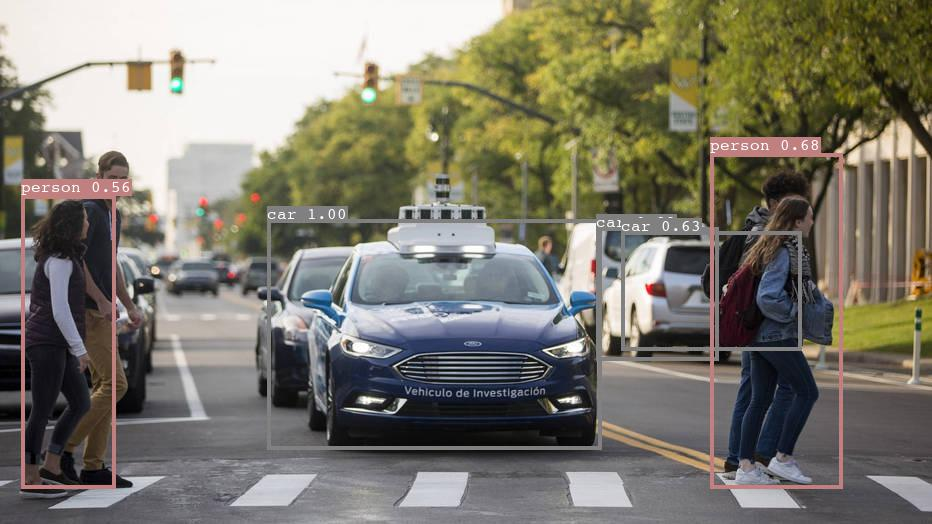 | 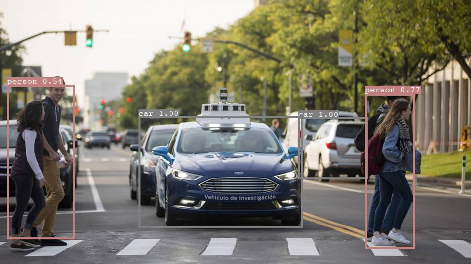 | 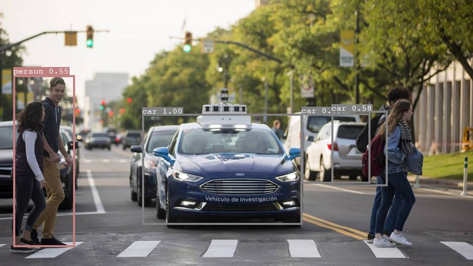 |
|  COCO-mAP  |         |    26.6%   |             |    25.2%    |     22.8%     |
| COCO-Image | |  | | 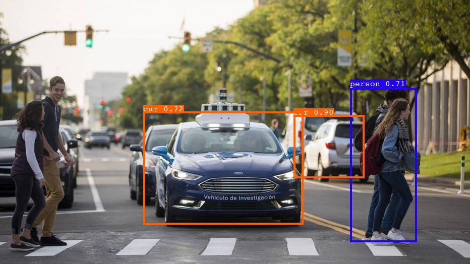 |  |

# 4.YOLO
### YOLOv1
|            |  Resnet50-7 | Resnet50-14 | resnet-7 | resnet-14 | vgg16-7 | vgg16-14 |
| ---------- | :---------: | :---------: | :------: | :-------: | :-----: | :------: |
|   VOC-mAP  |    61.1%    |     ---     |  58.4%   |           |         |          |
|  VOC-Image | 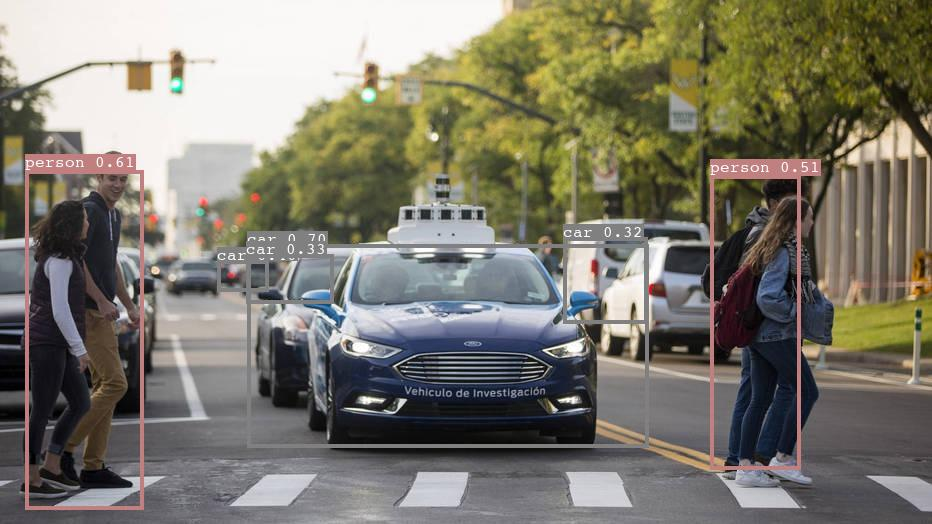 | - | 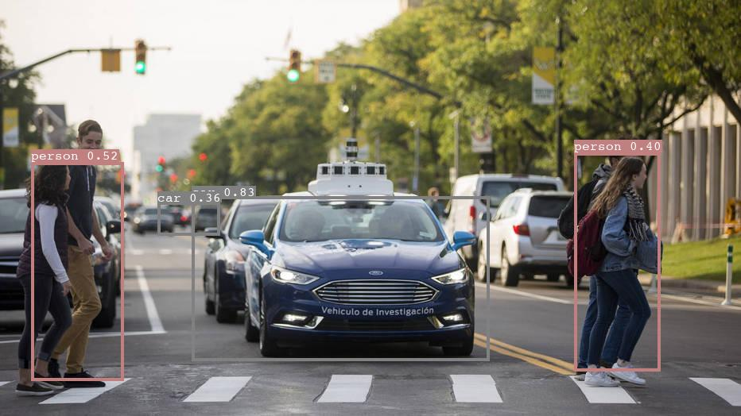 | | | |
|  COCO-mAP  |             |             |          |           |         |          |
| COCO-Image |             |             |          |           |         |          |

### YOLOv2
### YOLOv3
### YOLOv4
|            |  YOLOv4 |
| ---------- | :-----: |
|   VOC-mAP  |         |
|  VOC-Image |         |
|  COCO-mAP  |         |
| COCO-Image | 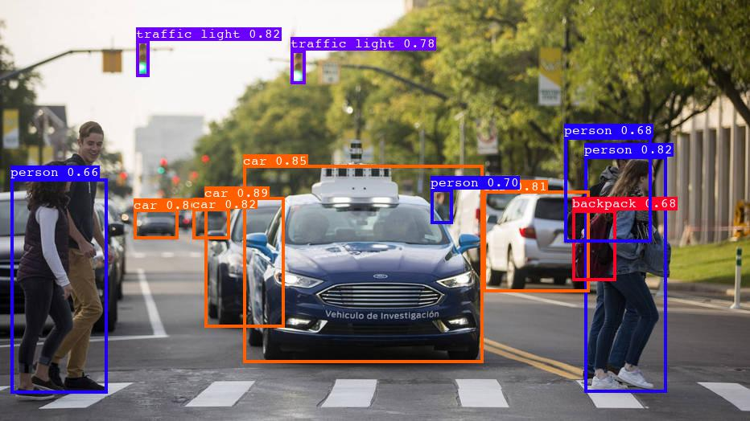 |

### YOLOv5
